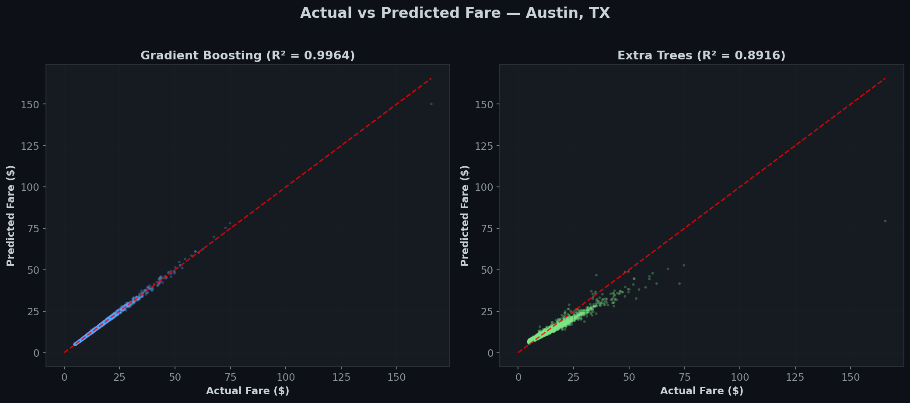
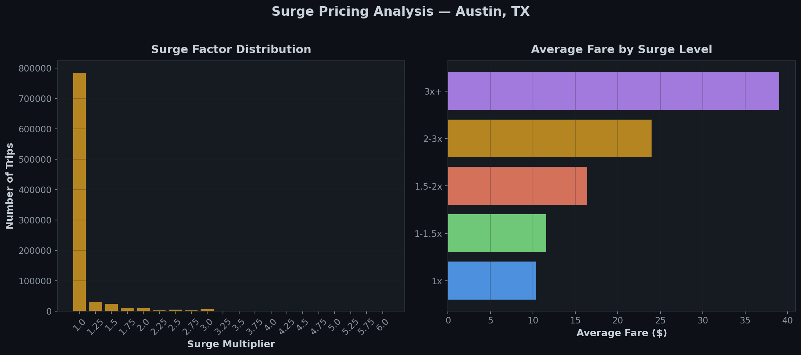

# Austin, TX — Ride-Hailing Data Analysis 🚕

[](https://www.python.org/downloads/release/python-3120/)
[](https://scikit-learn.org/)
[]()

**ALY6110 — Big Data Management & Analytics**

Comprehensive Exploratory Data Analysis (EDA), Machine Learning modeling, and cross-city comparison analysis on the RideAustin Weather dataset.

---

## 🌟 Portfolio Presentation & Visual Highlights

**[Download the Enhanced Project Presentation (PPTX)](Master_Deck_Final_group_presentation_Enhanced.pptx)** – A detailed, recruiter-ready walkthrough of the project's data insights, geospatial analysis, and machine learning pipeline (R² = 0.9964).

### Key Visual Insights

| Actual vs Predicted Fares (Gradient Boosting) | Surge Pricing Analysis |
| :---: | :---: |
|  |  |

---

## 📋 Project Overview

This project analyzes **911,057 ride-hailing records** from Austin, Texas (June 2016 – February 2017) merged with NOAA weather data. The analysis covers data cleaning, exploratory data analysis, predictive modeling, and integration with a multi-city combined dataset.

### Cities in Group Project
| City | Member | Records |
|------|--------|---------|
| New York City (HVFHV) | Teammate 1 | 199,957 |
| Chicago | Teammate 2 | 179,205 |
| Washington DC | Teammate 3 | 2,574,807 |
| San Francisco | Teammate 4 | 191,128 |
| **Austin, TX** | **Sumesh** | **909,830** |

**Combined Dataset: 4,054,927 records across 5 cities**

---

## 📁 Project Structure

```
├── RideAustin_Weather.csv          # Raw dataset (~166 MB)
├── taxi_ml_training 1.parquet      # Classmates' combined parquet
├── austin_analysis.py              # Main analysis pipeline
├── create_ppt.py                   # PPT generation script
├── Austin_Taxi_Analysis.pptx       # Final presentation (10 slides)
├── dashboard/
│   └── index.html                  # Interactive EDA dashboard
├── outputs/
│   ├── 01_fare_distribution.png    # Fare distribution plot
│   ├── 02_distance_distribution.png
│   ├── 03_hourly_demand.png
│   ├── 04_day_of_week.png
│   ├── 05_surge_analysis.png
│   ├── 06_weather_impact.png
│   ├── 07_distance_vs_fare.png     # Scatter + regression (r=0.849)
│   ├── 08_correlation_heatmap.png
│   ├── 09_car_category.png
│   ├── 10_monthly_trend.png
│   ├── 11_demand_heatmap.png
│   ├── 12_feature_importance.png
│   ├── 13_model_comparison.png
│   ├── 14_actual_vs_predicted.png
│   ├── 15_residual_analysis.png
│   ├── austin_cleaned.parquet      # Cleaned Austin-only data
│   ├── taxi_ml_training_combined.parquet  # 5-city merged dataset
│   ├── cleaning_summary.json
│   ├── eda_results.json
│   └── model_results.json
└── README.md
```

---

## 🔧 Setup & Requirements

```bash
pip install pandas numpy matplotlib seaborn scikit-learn pyarrow python-pptx
```

### Run the Analysis
```bash
python austin_analysis.py
```

### Generate Presentation
```bash
python create_ppt.py
```

### View Dashboard
Open `dashboard/index.html` in any web browser.

---

## 🧹 Data Cleaning

| Step | Records Removed |
|------|----------------|
| Invalid timestamps | 0 |
| Negative/zero duration | 17 |
| Duration > 2 hours | 160 |
| Zero/missing distance | 11 |
| Distance > 100 miles | 45 |
| Outside Austin bbox | 302 |
| **Total removed** | **535 (0.06%)** |
| **Final cleaned** | **910,522 records** |

### Feature Engineering
- Converted `distance_travelled` from meters to miles
- Computed `trip_duration_seconds` from timestamps
- Engineered `fare_amount` using RideAustin fare structure:
  - Base: $1.50 + $1.10/mile + $0.20/min × surge multiplier
- Extracted time features: `hour`, `dow`, `month`, `is_weekend`

---

## 📊 Key EDA Findings

| Metric | Value |
|--------|-------|
| Median fare | $8.31 |
| Median distance | 3.61 miles |
| Fare skewness | 4.36 (right-skewed) |
| Distance–fare correlation | r = 0.849 |
| Peak demand hour | Midnight–2 AM |
| Busiest day | Sunday |
| Surge ride percentage | 10.2% |
| Max surge multiplier | 6x |

---

## 🤖 Machine Learning Models

Both models are **unique** — classmates used Linear Regression and Random Forest.

| Model | R² Score | MAE | RMSE |
|-------|----------|-----|------|
| **Gradient Boosting** 🏆 | **0.9964** | **$0.29** | **$0.47** |
| Extra Trees | 0.8916 | $1.65 | $2.60 |

### Top Features (by importance)
1. Trip Duration
2. Trip Distance
3. Surge Factor
4. Hour of Day
5. Car Category

---

## 💡 Business Insights

- **Distance is the strongest predictor** of ride price (r = 0.849)
- **Surge multiplier** reflects demand elasticity — 10.2% of trips affected
- **Evening/night demand peaks** suggest entertainment-driven usage (Austin's 6th Street)
- **Weather correlates** with higher ride prices — rain increases average fares
- **95.1% REGULAR rides** — premium segments command 15–40% fare premium
- **Gradient Boosting predicts fares** with R² = 0.9964 and only $0.29 MAE

---

## 🌆 Cross-City Comparison

- **vs NYC**: Austin smaller scale, stronger surge impact, less congestion-driven
- **vs Chicago**: Chicago more linear pricing, Austin more demand-driven
- **vs DC**: DC has tipping patterns, Austin has surge-driven pricing
- **vs SF**: Both show tech-city characteristics, different terrain effects

---

## 📚 Dataset Source

- **RideAustin**: Open dataset from RideAustin (ride-hailing company in Austin, TX)
- **Weather**: NOAA weather station data (PRCP, TMAX, TMIN, AWND, Fog, Thunder)
- **Combined**: Merged ride data with daily weather observations

---

## 🛠 Tech Stack

- **Python 3.12** — pandas, numpy, matplotlib, seaborn, scikit-learn
- **Parquet** — Apache Arrow for efficient columnar storage
- **HTML/CSS/JS** — Interactive dashboard
- **python-pptx** — Programmatic presentation generation

---

*ALY6110 — Big Data Management & Analytics | February 2026*
